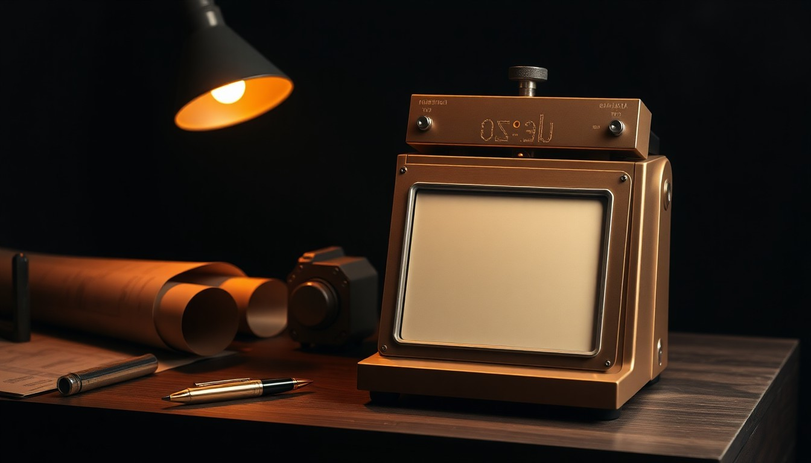
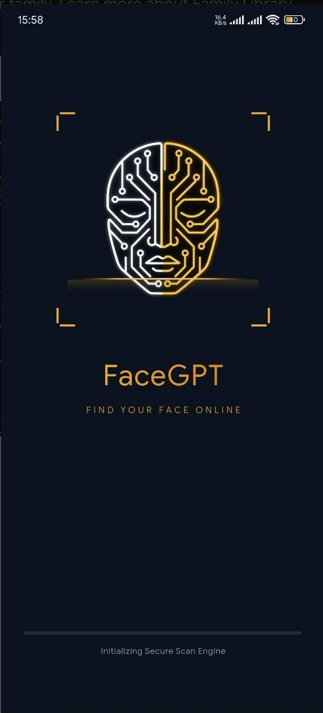

# Parth Kothawade — Portfolio · FULL SOURCE DUMP

> Verbatim source of every code file in the project. Companion to PROJECT-REPORT.md.
> Files: index.html, css/site.css, js/site.js, js/next.js.

---

## index.html

```html
<!DOCTYPE html>
<html lang="en">
<head>
<meta charset="UTF-8" />
<meta name="viewport" content="width=device-width, initial-scale=1.0" />
<title>Parth Kothawade — AI Product Engineer</title>
<meta name="description" content="I build AI products that people actually use." />
<meta name="color-scheme" content="dark" />
<link rel="preconnect" href="https://fonts.googleapis.com">
<link rel="preconnect" href="https://fonts.gstatic.com" crossorigin>
<link href="https://fonts.googleapis.com/css2?family=Fraunces:ital,opsz,wght@0,9..144,400;0,9..144,500;0,9..144,600;1,9..144,500&family=Inter:wght@400;500;600&family=JetBrains+Mono:wght@500&family=Dancing+Script:wght@600&display=swap" rel="stylesheet">
<link rel="stylesheet" href="css/site.css" />
</head>
<body>

  <!-- CINEMATIC ENTRANCE / SPLASH -->
  <div class="splash" id="splash" role="dialog" aria-label="Enter the studio">
    <div class="sp-bg" id="spBg"></div>
    <div class="sp-grain"></div>
    <div class="sp-spot" id="spSpot"></div>
    <div class="sp-vignette"></div>
    <canvas class="sp-embers" id="spEmbers"></canvas>
    <div class="sp-core">
      <div class="sp-intro" id="spIntro"></div>
      <h1 class="sp-name">
        <span class="sp-fname">PARTH</span>
        <span class="sp-lname">KOTHAWADE</span>
      </h1>
      <div class="sp-tag">I build AI products that <span class="rot" id="spRot">people actually use.</span></div>
      <div class="sp-loadwrap"><div class="sp-load" id="spLoad"></div></div>
      <div class="sp-status" id="spStatus">waking the studio…</div>
      <button class="sp-enter" id="spEnter" type="button">Enter the Studio <i>→</i></button>
      <div class="sp-hint">press <b>Enter</b> · or click anywhere</div>
    </div>
  </div>

  <div class="progress" id="progress"></div>
  <div class="cur-ring" id="curRing"></div>
  <div class="cur-dot" id="curDot"></div>

  <!-- NAV -->
  <header class="nav">
    <a class="brand" href="#top"><span class="bn">PARTH</span><span class="bs">The Studio</span></a>
    <nav class="links">
      <a href="#work">The Work</a>
      <a href="#method">The Method</a>
      <a href="#about">About</a>
      <a class="cta" href="#contact">Start a Project<i></i></a>
    </nav>
  </header>

  <!-- HERO -->
  <section class="hero" id="top">
    <div class="hero-bg">
      <div class="hero-stage" id="heroStage">
        
        <canvas class="hero-gl" id="heroGL" aria-hidden="true"></canvas>
        <div class="hero-screen" id="heroScreen" aria-hidden="true">
          <div class="scr-feed" id="screenFeed"></div>
          <div class="scr-glass"></div>
        </div>
      </div>
    </div>
    <div class="hero-scrim"></div>
    <div class="hero-inner">
      <p class="eyebrow a1">AI Product Engineer</p>
      <h1 class="h-title">
        <span class="a2">I build AI&nbsp;products</span><br>
        <span class="a3">that people</span><br>
        <span class="a3"><em>actually&nbsp;use.</em></span>
      </h1>
      <p class="h-sub a4">I don't prompt models. I design the systems around them, make the architectural calls, and ship products that create real impact — in days, not months.</p>
      <div class="h-stats a5">
        <div class="st"><b>00</b><span>Days<br>not months</span></div>
        <div class="st"><b>00+</b><span>Products<br>shipped</span></div>
        <div class="st"><b>₹00L+</b><span>Cost replaced<br>for clients</span></div>
      </div>
      <div class="h-now a6"><span class="dot"></span>Now showing — <b>ApplySync</b> · live in production</div>
    </div>
    <a class="scrollcue" href="#work" aria-label="Scroll">scroll<i></i></a>
  </section>

  <!-- SELECTED WORK -->
  <section class="band" id="work">
    <div class="wrap">
      <div class="sec-head">
        <div class="sec-no">01 — The Work</div>
        <h2 class="sec-title">Real products. Real users. Real impact.</h2>
        <p class="sec-lead">Shipped to app stores and production — not demos.</p>
      </div>
      <div class="work-grid" id="workGrid">
        <button class="tile" data-proj="applysync">
          <span class="tile-shot site"></span>
          <span class="tile-foot"><span class="tile-c">01 · AI Job Automation · My startup</span><span class="tile-t">ApplySync</span><span class="tile-go">View case study <i>→</i></span></span>
        </button>
        <button class="tile" data-proj="facegpt">
          <span class="tile-shot app"><span class="phone"><span class="phone-notch"></span></span><span class="tile-badge">Android · Live</span></span>
          <span class="tile-foot"><span class="tile-c">02 · AI Reverse Image Search</span><span class="tile-t">FaceGPT</span><span class="tile-go">View case study <i>→</i></span></span>
        </button>
        <button class="tile" data-proj="skingpt">
          <span class="tile-shot app"><span class="phone"><span class="phone-notch"></span></span><span class="tile-badge">iOS · Live</span></span>
          <span class="tile-foot"><span class="tile-c">03 · AI Personal Style</span><span class="tile-t">SkinGPT</span><span class="tile-go">View case study <i>→</i></span></span>
        </button>
        <button class="tile" data-proj="iasa">
          <span class="tile-shot site"></span>
          <span class="tile-foot"><span class="tile-c">04 · Healthcare AI · Production</span><span class="tile-t">I Am Still Alive</span><span class="tile-go">View case study <i>→</i></span></span>
        </button>
        <button class="tile" data-proj="conference">
          <span class="tile-shot site"></span>
          <span class="tile-foot"><span class="tile-c">05 · Events Platform · Enterprise</span><span class="tile-t">Conference &amp; Events Platform</span><span class="tile-go">View case study <i>→</i></span></span>
        </button>
        <button class="tile" data-proj="portal">
          <span class="tile-shot site"></span>
          <span class="tile-foot"><span class="tile-c">06 · Operations Platform · In daily use</span><span class="tile-t">Management Portal</span><span class="tile-go">View case study <i>→</i></span></span>
        </button>
      </div>
    </div>
  </section>

  <!-- MANIFESTO (cinematic band) -->
  <section class="manifesto">
    <div class="man-bg"></div>
    <div class="man-scrim"></div>
    <div class="wrap man-inner">
      <p class="man-quote">“The hardest, most human part isn't writing the code.<br>It's deciding <em>what</em> to build, and being right.”</p>
    </div>
  </section>

  <!-- THE METHOD -->
  <section class="band" id="method">
    <div class="wrap method-grid">
      <div class="method-copy">
        <div class="sec-no">02 — The Method</div>
        <h2 class="sec-title sm">Ask my work.</h2>
        <p class="sec-lead">Don't take my word for it — interrogate the record. Pick a question; I'll answer it from real projects.</p>
        <a class="link-arrow" href="#contact">Start a conversation →</a>
      </div>
      <div class="terminal" id="terminal">
        <div class="t-bar"><i></i><i></i><i></i></div>
        <div class="t-body">
          <div class="t-q" id="tQ">&gt; how do you decide what to build?</div>
          <pre class="t-a" id="tA">I start from the problem, not the model. What hurts, who feels it, and is AI actually the right tool? Most ideas die here — and that's the point. I only build what earns a place in production.</pre>
        </div>
        <div class="t-chips" id="tChips"></div>
        <form class="t-foot" id="tForm"><span class="tp">&gt;</span><input id="tInput" class="t-input" type="text" placeholder="ask me anything about my work…" autocomplete="off" aria-label="Ask my work" /><span class="rag">powered by RAG</span></form>
      </div>
    </div>
  </section>

  <!-- ABOUT -->
  <section class="band about" id="about">
    <div class="wrap about-grid">
      <div class="about-portrait"></div>
      <div class="about-copy">
        <div class="sec-no">03 — About</div>
        <h2 class="about-h">I don't build demos.<br>I build products.</h2>
        <p class="about-p">I care about systems that work. I care about users who trust them. I care about impact that compounds. I'm an AI-native builder from Pune — I design the architecture, direct the AI, and own the outcome end to end.</p>
        <div class="sig">Parth</div>
      </div>
      <div class="about-values">
        <div class="val"><b>Shipped</b><span>Real products</span></div>
        <div class="val"><b>Solved</b><span>Real problems</span></div>
        <div class="val"><b>Created</b><span>Real impact</span></div>
      </div>
    </div>
  </section>

  <!-- FOOTER -->
  <footer class="foot" id="contact">
    <div class="wrap">
      <div class="foot-top">
        <div>
          <p class="foot-lead">Let's build something<br>that actually matters.</p>
          <a class="cta big" href="mailto:parthkothawade2310@gmail.com">Start a Project →</a>
        </div>
        <div class="foot-status">
          <div class="fs"><span>Location</span><b>Pune, India</b></div>
          <div class="fs"><span>Time</span><b id="clock">—</b></div>
          <div class="fs"><span>Status</span><b class="ok">Available for meaningful work<i></i></b></div>
          <div class="fs"><span>Connect</span><b><a href="https://github.com/TechieParth2310" target="_blank" rel="noopener">GitHub</a> · <a href="mailto:parthkothawade2310@gmail.com">Email</a></b></div>
        </div>
      </div>
      <div class="foot-bottom"><span>© 2026 Parth Kothawade</span><span>Built with obsession. Shipped with impact.</span></div>
    </div>
  </footer>

  <!-- FULL-SCREEN CASE STUDY -->
  <div class="case" id="drawer" role="dialog" aria-modal="true" aria-labelledby="drTitle">
    <div class="case-scrim" id="drScrim"></div>
    <div class="case-panel">
      <button class="case-close" id="drClose" aria-label="Close case study">✕</button>
      <div class="case-scroll" id="drBody"></div>
    </div>
  </div>

  <!-- COMMAND PALETTE -->
  <div class="cmdk" id="cmdk" role="dialog" aria-modal="true" aria-label="Command palette">
    <div class="cmdk-box">
      <input class="cmdk-in" id="cmdkIn" type="text" placeholder="Type a command or search…" autocomplete="off" />
      <div class="cmdk-list" id="cmdkList"></div>
      <div class="cmdk-hint">↑ ↓ navigate · ↵ run · esc close</div>
    </div>
  </div>

  <!-- SOUND TOGGLE -->
  <button class="snd" id="snd" type="button" aria-label="Toggle sound"><span class="bars"><i></i><i></i><i></i><i></i></span></button>

  <script src="js/site.js"></script>
  <script src="https://cdnjs.cloudflare.com/ajax/libs/three.js/r128/three.min.js"></script>
  <script src="js/next.js"></script>
</body>
</html>
```

---

## css/site.css

```css
/* ============================================================
   Parth Kothawade — cinematic portfolio
   Image-first. Dark. Brass. Editorial. Visible by default.
   ============================================================ */
:root{
  --bg:#08090B; --bg2:#0D0F12; --panel:#14161A; --panel2:#191C21;
  --ink:#EAE5D9; --ink-soft:#CBC6BA; --mut:#8A8E96;
  --line:rgba(234,229,217,.10); --line2:rgba(234,229,217,.18);
  --brass:#C7924F; --brass-l:#E0B57C; --brass-d:#A8773A; --green:#82CF90;
  --serif:'Fraunces',Georgia,serif; --sans:'Inter',system-ui,sans-serif; --mono:'JetBrains Mono',monospace; --script:'Dancing Script',cursive;
  --maxw:1320px; --gut:clamp(22px,5vw,80px);
  --ease:cubic-bezier(.16,1,.3,1); --ease2:cubic-bezier(.22,.61,.36,1);
}
*{box-sizing:border-box;margin:0;padding:0}
html{scroll-behavior:smooth}
body{background:var(--bg);color:var(--ink);font-family:var(--sans);font-size:16px;line-height:1.6;-webkit-font-smoothing:antialiased;overflow-x:hidden}
::selection{background:rgba(199,146,79,.3)}
a{color:inherit;text-decoration:none}
.wrap{max-width:var(--maxw);margin:0 auto;padding:0 var(--gut)}
img{display:block;max-width:100%}

/* entrance (pure CSS — no JS gating) */
@keyframes rise{from{opacity:0;transform:translateY(22px)}to{opacity:1;transform:none}}
.a1,.a2,.a3,.a4,.a5,.a6{opacity:0;animation:rise 1s var(--ease) forwards}
.a1{animation-delay:.15s}.a2{animation-delay:.45s}.a3{animation-delay:.62s}.a4{animation-delay:.9s}.a5{animation-delay:1.1s}.a6{animation-delay:1.3s}

/* NAV */
.nav{position:fixed;top:0;left:0;right:0;z-index:50;display:flex;align-items:center;justify-content:space-between;
  padding:22px var(--gut);transition:padding .3s,background .3s}
.nav.scrolled{padding:14px var(--gut);background:rgba(8,9,11,.7);backdrop-filter:blur(14px);border-bottom:1px solid var(--line)}
.brand{display:flex;flex-direction:column;gap:2px;line-height:1}
.bn{font-weight:600;font-size:15px;letter-spacing:.32em}
.bs{font-family:var(--mono);font-size:9px;letter-spacing:.26em;text-transform:uppercase;color:var(--mut)}
.links{display:flex;align-items:center;gap:clamp(18px,2.4vw,38px)}
.links a{font-size:13.5px;color:var(--ink-soft);transition:color .3s}
.links a:hover{color:var(--ink)}
.cta{display:inline-flex;align-items:center;gap:9px;border:1px solid var(--line2);border-radius:2px;padding:11px 19px;color:var(--ink) !important;font-size:12.5px;letter-spacing:.05em;transition:.3s var(--ease)}
.cta i{width:5px;height:5px;border-radius:50%;background:var(--brass);transition:.3s}
.cta:hover{transform:translateY(-2px);border-color:var(--brass)}
.cta:hover i{transform:scale(1.6)}
@media(max-width:760px){.links a:not(.cta){display:none}}

/* HERO */
.hero{position:relative;min-height:100svh;display:flex;align-items:center;overflow:hidden}
.hero-bg{position:absolute;inset:0;z-index:0;overflow:hidden}
.hero-stage{position:absolute;inset:0;will-change:transform;transform-origin:center}
.hero-stage img{width:100%;height:100%;object-fit:cover;object-position:50% 50%;display:block}

/* live "studio display" on the device screen — positioned by JS cover-geometry */
.hero-screen{position:absolute;left:0;top:0;width:0;height:0;z-index:2;border-radius:5px;overflow:hidden;
  background:radial-gradient(120% 120% at 50% 0%, #efe6d2 0%, #e4d8bf 60%, #d8c8a8 100%);
  box-shadow:inset 0 0 22px rgba(120,84,40,.35), inset 0 2px 6px rgba(255,255,255,.4);
  opacity:0;transition:opacity .9s ease .3s}
.hero-screen.lit{opacity:1;animation:scrFlick 6s infinite}
@keyframes scrFlick{0%,96%,100%{filter:brightness(1)}97%{filter:brightness(.93)}98%{filter:brightness(1.04)}}
.scr-glass{position:absolute;inset:0;z-index:3;pointer-events:none;
  background:repeating-linear-gradient(0deg, rgba(80,52,20,.06) 0 2px, rgba(255,255,255,.02) 2px 4px);
  box-shadow:inset 0 0 30px rgba(120,80,40,.22)}
.scr-feed{position:absolute;inset:0;z-index:2;padding:9% 10%;font-family:var(--mono);
  color:#2c1d0c;line-height:1.65;display:flex;flex-direction:column;justify-content:center;
  text-shadow:0 1px 0 rgba(255,255,255,.35);font-size:13px}
.scr-h{font-size:.74em;letter-spacing:.14em;text-transform:uppercase;color:#8a5e28;
  margin-bottom:1em;display:flex;align-items:center;gap:.55em;font-weight:600}
.scr-h .d{width:.55em;height:.55em;border-radius:50%;background:#3f9a4f;
  box-shadow:0 0 6px #4caf5a;animation:scrPulse 1.6s ease-in-out infinite}
@keyframes scrPulse{0%,100%{opacity:1}50%{opacity:.35}}
.scr-row{font-size:.92em;white-space:nowrap;overflow:hidden;color:#2a1c0b;min-height:1.6em}
.scr-row .nm{color:#1d1407}
.scr-row .vl{color:#9a4a18;font-weight:600}
.scr-row .dots{color:#a98c5e}
.scr-cur{display:inline-block;width:.55em;height:1.05em;background:#2c1d0c;
  vertical-align:-2px;margin-left:1px;animation:scrBlink 1s steps(1) infinite}
@keyframes scrBlink{0%,50%{opacity:1}51%,100%{opacity:0}}
@media(max-width:600px){.hero-screen{display:none}}
.hero-scrim{position:absolute;inset:0;z-index:1;background:
  linear-gradient(90deg, rgba(7,8,10,.95) 0%, rgba(7,8,10,.78) 34%, rgba(7,8,10,.32) 58%, rgba(7,8,10,0) 82%),
  linear-gradient(0deg, rgba(7,8,10,.7) 0%, transparent 38%)}
.hero-inner{position:relative;z-index:2;max-width:var(--maxw);width:100%;margin:0 auto;padding:120px var(--gut) 0}
.eyebrow{font-family:var(--mono);font-size:11px;letter-spacing:.26em;text-transform:uppercase;color:var(--brass);margin-bottom:22px}
.h-title{font-family:var(--serif);font-weight:500;font-size:clamp(40px,5.2vw,76px);line-height:1.04;letter-spacing:-.02em;font-optical-sizing:auto;max-width:600px}
.h-title em{font-style:italic}
.h-sub{margin-top:26px;max-width:540px;font-size:clamp(15.5px,1.2vw,18px);line-height:1.7;color:var(--ink-soft)}
.h-stats{display:flex;gap:clamp(24px,3vw,48px);margin-top:40px;flex-wrap:wrap}
.st b{display:block;font-family:var(--serif);font-weight:500;font-size:clamp(24px,2.4vw,32px);line-height:1}
.st b .am{color:var(--brass)}
.st span{display:block;margin-top:8px;font-family:var(--mono);font-size:10px;letter-spacing:.08em;text-transform:uppercase;color:var(--mut);line-height:1.5}
.h-now{display:inline-flex;align-items:center;gap:9px;margin-top:42px;font-family:var(--mono);font-size:11px;letter-spacing:.04em;color:var(--ink-soft);
  border:1px solid var(--line);border-radius:30px;padding:8px 15px;background:rgba(13,15,18,.5);backdrop-filter:blur(8px)}
.h-now b{color:var(--ink);font-weight:500}
.h-now .dot{width:7px;height:7px;border-radius:50%;background:var(--green);box-shadow:0 0 0 3px rgba(130,207,144,.18);animation:pulse 2.4s ease-in-out infinite}
@keyframes pulse{0%,100%{opacity:1}50%{opacity:.5}}
.scrollcue{position:absolute;bottom:26px;left:50%;transform:translateX(-50%);z-index:2;font-family:var(--mono);font-size:9.5px;letter-spacing:.22em;text-transform:uppercase;color:var(--mut);display:flex;flex-direction:column;align-items:center;gap:8px}
.scrollcue i{width:1px;height:34px;background:linear-gradient(var(--brass),transparent);animation:cue 2s ease-in-out infinite}
@keyframes cue{0%,100%{opacity:.3;transform:scaleY(.6)}50%{opacity:1;transform:scaleY(1)}}

/* SECTION shell */
.band{position:relative;z-index:2;padding:clamp(70px,9vw,120px) 0;border-top:1px solid var(--line);background:var(--bg)}
.sec-no{font-family:var(--mono);font-size:11px;letter-spacing:.18em;text-transform:uppercase;color:var(--brass);margin-bottom:16px;display:flex;align-items:center;gap:10px}
.sec-no::before{content:"";width:18px;height:1px;background:var(--brass)}
.sec-title{font-family:var(--serif);font-weight:500;font-size:clamp(28px,3.4vw,46px);line-height:1.06;letter-spacing:-.01em;max-width:760px}
.sec-title.sm{font-size:clamp(26px,2.4vw,34px)}
.sec-lead{margin-top:14px;color:var(--mut);font-size:16px;line-height:1.7;max-width:600px}
.sec-head{margin-bottom:46px}
.link-arrow{display:inline-flex;align-items:center;gap:8px;margin-top:22px;font-family:var(--mono);font-size:11px;letter-spacing:.12em;text-transform:uppercase;color:var(--ink);transition:gap .3s var(--ease),color .3s}
.link-arrow:hover{gap:14px;color:var(--brass)}

/* WORK — framed editorial gallery */
.work-grid{display:grid;grid-template-columns:repeat(12,1fr);gap:18px}
.tile{display:flex;flex-direction:column;border-radius:16px;overflow:hidden;border:1px solid var(--line);background:var(--panel);
  cursor:pointer;text-align:left;font:inherit;color:inherit;appearance:none;
  transition:transform .5s var(--ease),box-shadow .5s,border-color .3s;will-change:transform}
.tile:nth-child(1){grid-column:span 7}.tile:nth-child(2){grid-column:span 5}
.tile:nth-child(3){grid-column:span 5}.tile:nth-child(4){grid-column:span 7}
.tile:nth-child(5){grid-column:span 7}.tile:nth-child(6){grid-column:span 5}
.tile:hover{transform:translateY(-8px);border-color:var(--line2);box-shadow:0 46px 90px -38px rgba(0,0,0,1)}
.tile:focus-visible{outline:2px solid var(--brass);outline-offset:3px}
.tile-shot{position:relative;height:240px;overflow:hidden;flex:0 0 auto}
.tile-shot.site img{width:100%;height:100%;object-fit:cover;object-position:top center;transition:object-position 3s var(--ease),transform .6s var(--ease)}
.tile:hover .tile-shot.site img{object-position:bottom center}
.tile-shot.site::after{content:"";position:absolute;left:0;right:0;bottom:0;height:70px;background:linear-gradient(transparent,var(--panel));pointer-events:none}
.tile-shot.app{display:grid;place-items:center;background:radial-gradient(120% 90% at 70% -12%,rgba(199,146,79,.16),transparent 55%),linear-gradient(160deg,#1b1e24,#0b0d10)}
.phone{position:relative;width:120px;height:216px;border-radius:22px;background:#0e1014;border:4px solid #23262d;overflow:hidden;
  box-shadow:0 28px 46px -20px rgba(0,0,0,.95), inset 0 0 0 1px rgba(255,255,255,.05);transition:transform .5s var(--ease)}
.tile:hover .phone{transform:translateY(-5px) scale(1.03)}
.phone img{width:100%;height:100%;object-fit:cover;object-position:top}
.phone-notch{position:absolute;top:7px;left:50%;transform:translateX(-50%);width:38px;height:5px;border-radius:3px;background:rgba(255,255,255,.22);z-index:2}
.tile-badge{position:absolute;left:16px;top:16px;font-family:var(--mono);font-size:9px;letter-spacing:.1em;text-transform:uppercase;color:var(--brass);border:1px solid var(--line2);border-radius:20px;padding:5px 11px;background:rgba(8,9,11,.45)}
.tile-foot{padding:20px 22px;display:flex;flex-direction:column;gap:7px;border-top:1px solid var(--line)}
.tile-c{font-family:var(--mono);font-size:9.5px;letter-spacing:.1em;text-transform:uppercase;color:var(--brass)}
.tile-t{font-family:var(--serif);font-weight:500;font-size:clamp(20px,1.9vw,26px);line-height:1.05;letter-spacing:-.01em}
.tile-go{font-family:var(--mono);font-size:10px;letter-spacing:.1em;text-transform:uppercase;color:var(--ink-soft);display:inline-flex;align-items:center;gap:8px;margin-top:2px}
.tile-go i{color:var(--brass);transition:transform .3s var(--ease);font-style:normal}
.tile:hover .tile-go{color:var(--ink)}.tile:hover .tile-go i{transform:translateX(6px)}
@media(max-width:900px){.work-grid{grid-template-columns:1fr;gap:14px}.tile{grid-column:auto !important}}

/* MANIFESTO */
.manifesto{position:relative;min-height:62svh;display:flex;align-items:center;overflow:hidden;z-index:2}
.man-bg{position:absolute;inset:0;z-index:0}
.man-bg img{width:100%;height:100%;object-fit:cover;object-position:center}
.man-scrim{position:absolute;inset:0;z-index:1;background:linear-gradient(90deg,rgba(7,8,10,.92),rgba(7,8,10,.55) 55%,rgba(7,8,10,.2))}
.man-inner{position:relative;z-index:2}
.man-quote{font-family:var(--serif);font-weight:500;font-style:italic;font-size:clamp(24px,3.6vw,46px);line-height:1.25;letter-spacing:-.01em;max-width:880px}
.man-quote em{color:var(--brass);font-style:italic}

/* METHOD / TERMINAL */
.method-grid{display:grid;grid-template-columns:.9fr 1.1fr;gap:clamp(34px,5vw,70px);align-items:center}
.terminal{background:#0A0B0D;border:1px solid var(--line2);border-radius:12px;overflow:hidden;box-shadow:0 40px 80px -40px rgba(0,0,0,.9)}
.t-bar{display:flex;gap:7px;padding:13px 16px;border-bottom:1px solid var(--line)}
.t-bar i{width:10px;height:10px;border-radius:50%;background:rgba(234,229,217,.16)}
.t-body{padding:18px 18px 8px;min-height:200px;font-family:var(--mono);font-size:12.5px;line-height:1.75}
.t-q{color:var(--ink);margin-bottom:12px}
.t-a{white-space:pre-wrap;color:#9aa0a0;font-family:var(--mono);font-size:12.5px;line-height:1.75;margin:0}
.t-chips{display:flex;flex-direction:column;gap:8px;padding:6px 18px 14px}
.t-chip{text-align:left;font-family:var(--mono);font-size:11.5px;color:#c0bbae;border:1px solid var(--line);border-radius:9px;padding:10px 13px;cursor:pointer;transition:.2s}
.t-chip::before{content:"> ";color:var(--brass)}
.t-chip:hover{border-color:var(--brass);color:var(--brass)}
.t-foot{display:flex;justify-content:space-between;align-items:center;padding:12px 18px;border-top:1px solid var(--line);font-family:var(--mono);font-size:10px;color:var(--mut)}
.caret{display:inline-block;width:7px;height:13px;background:var(--green);vertical-align:-2px;animation:blink 1.1s steps(1) infinite}
@keyframes blink{50%{opacity:0}}
.rag{color:var(--green);letter-spacing:.12em;text-transform:uppercase}
@media(max-width:840px){.method-grid{grid-template-columns:1fr;gap:30px}}

/* ABOUT */
.about-grid{display:grid;grid-template-columns:300px 1fr 220px;gap:clamp(34px,4vw,60px);align-items:center}
.about-portrait{position:relative;width:100%;aspect-ratio:4/5;border-radius:14px;overflow:hidden;border:1px solid var(--line2);box-shadow:0 44px 90px -44px rgba(0,0,0,.95)}
.about-portrait img{width:100%;height:100%;object-fit:cover;object-position:center top;filter:grayscale(.15) contrast(1.04)}
.about-h{font-family:var(--serif);font-weight:500;font-size:clamp(28px,3.4vw,46px);line-height:1.06;letter-spacing:-.01em}
.about-p{margin-top:20px;color:var(--ink-soft);font-size:16px;line-height:1.8;max-width:560px}
.sig{margin-top:18px;font-family:var(--script);font-size:34px;color:var(--brass);line-height:1}
.about-values{display:flex;flex-direction:column;gap:24px}
.val b{font-family:var(--serif);font-weight:500;font-size:19px;display:block}
.val span{font-family:var(--mono);font-size:10px;letter-spacing:.1em;text-transform:uppercase;color:var(--mut);display:block;margin-top:3px}
@media(max-width:980px){.about-grid{grid-template-columns:240px 1fr}.about-values{grid-column:1/-1;flex-direction:row;flex-wrap:wrap;gap:30px}}
@media(max-width:600px){.about-grid{grid-template-columns:1fr}}

/* FOOTER */
.foot{position:relative;z-index:2;border-top:1px solid var(--line);padding:clamp(56px,7vw,90px) 0 34px;background:linear-gradient(180deg,transparent,rgba(0,0,0,.4))}
.foot-top{display:grid;grid-template-columns:1fr 1fr;gap:40px;align-items:start}
.foot-lead{font-family:var(--serif);font-size:clamp(26px,3vw,40px);line-height:1.12;margin-bottom:24px}
.cta.big{padding:14px 24px;font-size:13.5px}
.foot-status{display:flex;flex-direction:column;gap:14px}
.fs{display:flex;gap:18px;align-items:baseline}
.fs span{font-family:var(--mono);font-size:9.5px;letter-spacing:.14em;text-transform:uppercase;color:var(--mut);width:78px;flex:0 0 auto}
.fs b{font-weight:500;font-size:14px;color:var(--ink)}
.fs b a{color:var(--ink-soft)}.fs b a:hover{color:var(--brass)}
.fs .ok{color:var(--green);display:flex;align-items:center;gap:8px}
.fs .ok i{width:7px;height:7px;border-radius:50%;background:var(--green);box-shadow:0 0 0 3px rgba(130,207,144,.18);animation:pulse 2.4s ease-in-out infinite}
.foot-bottom{display:flex;justify-content:space-between;gap:16px;flex-wrap:wrap;margin-top:44px;padding-top:18px;border-top:1px solid var(--line);font-family:var(--mono);font-size:10.5px;color:var(--mut)}
@media(max-width:760px){.foot-top{grid-template-columns:1fr;gap:30px}.foot-bottom{flex-direction:column;gap:8px}}

/* ============ FULL-SCREEN CASE STUDY ============ */
.case{position:fixed;inset:0;z-index:300;display:none}
.case.open{display:block}
.case-scrim{position:absolute;inset:0;background:rgba(4,5,7,.7);backdrop-filter:blur(6px);opacity:0;transition:opacity .4s}
.case.show .case-scrim{opacity:1}
.case-panel{position:absolute;inset:0;background:var(--bg);overflow:hidden;opacity:0;transform:scale(1.03);transition:opacity .5s var(--ease),transform .65s var(--ease)}
.case.show .case-panel{opacity:1;transform:none}
.case-close{position:fixed;top:22px;right:24px;z-index:20;width:46px;height:46px;border-radius:50%;border:1px solid var(--line2);
  background:rgba(13,15,18,.6);backdrop-filter:blur(10px);color:var(--ink);font-size:16px;cursor:pointer;transition:.3s var(--ease)}
.case-close:hover{border-color:var(--brass);color:var(--brass);transform:rotate(90deg)}
.case-scroll{position:absolute;inset:0;overflow-y:auto;scroll-behavior:smooth}
.case-scroll::-webkit-scrollbar{width:10px}.case-scroll::-webkit-scrollbar-thumb{background:rgba(234,229,217,.14);border-radius:8px;border:2px solid var(--bg)}

/* case — clean hero */
.cs-top{position:relative;max-width:var(--maxw);margin:0 auto;padding:clamp(84px,11vw,140px) var(--gut) 0}
.cs-top::before{content:"";position:absolute;inset:0;background:radial-gradient(52% 70% at 84% 4%,rgba(199,146,79,.13),transparent 62%);pointer-events:none}
.cs-cat{position:relative;font-family:var(--mono);font-size:11px;letter-spacing:.16em;text-transform:uppercase;color:var(--brass);margin-bottom:16px}
.cs-title{position:relative;font-family:var(--serif);font-weight:500;font-size:clamp(40px,6vw,88px);line-height:.98;letter-spacing:-.025em}
.cs-tag{position:relative;font-family:var(--serif);font-style:italic;font-size:clamp(18px,1.9vw,24px);color:var(--ink-soft);margin-top:18px;max-width:700px;line-height:1.42}
.cs-facts{position:relative;display:flex;flex-wrap:wrap;gap:38px;margin-top:32px}
.cs-fact span{display:block;font-family:var(--mono);font-size:10px;letter-spacing:.1em;text-transform:uppercase;color:var(--mut);margin-bottom:6px}
.cs-fact b{font-weight:500;font-size:15px;color:var(--ink)}
.cs-cta{position:relative;display:inline-flex;align-items:center;gap:10px;margin-top:32px;font-size:14px;font-weight:600;color:#08090b;background:var(--brass);border-radius:9px;padding:14px 24px;transition:.25s var(--ease)}
.cs-cta:hover{background:var(--brass-l);transform:translateY(-2px)}
/* case — framed showcase */
.cs-show{display:flex;justify-content:center;padding:54px var(--gut) 18px}
.frame{position:relative;box-shadow:0 70px 140px -55px rgba(0,0,0,1);animation:rise 1s var(--ease) both}
.frame.browser{width:100%;max-width:980px;border-radius:13px;overflow:hidden;border:1px solid var(--line2);background:#0e1014}
.fr-bar{display:flex;align-items:center;gap:8px;padding:12px 15px;background:#16181d;border-bottom:1px solid var(--line)}
.fr-bar i{width:11px;height:11px;border-radius:50%}
.fr-bar i:nth-child(1){background:#e0655a}.fr-bar i:nth-child(2){background:#dbab4e}.fr-bar i:nth-child(3){background:#63b365}
.fr-url{margin-left:12px;font-family:var(--mono);font-size:11px;color:var(--mut);background:#0c0e12;border:1px solid var(--line);border-radius:6px;padding:5px 14px}
.fr-shot{max-height:620px;overflow:hidden;background:#0e1014}
.fr-shot img{width:100%;display:block}
.frame.phone-lg{width:300px;border-radius:40px;border:10px solid #1b1e25;background:#0e1014;overflow:hidden}
.frame.phone-lg .pn{position:absolute;top:14px;left:50%;transform:translateX(-50%);width:120px;height:24px;background:#1b1e25;border-radius:0 0 16px 16px;z-index:2}
.frame.phone-lg img{width:100%;display:block}
/* case — body */
.cs-grid{display:grid;grid-template-columns:1.1fr .9fr;gap:clamp(34px,5vw,76px);max-width:var(--maxw);margin:0 auto;padding:40px var(--gut) 120px;border-top:1px solid var(--line);margin-top:46px}
.cs-sec{margin-bottom:38px}
.cs-sec .l{font-family:var(--mono);font-size:11px;letter-spacing:.16em;text-transform:uppercase;color:var(--brass);margin-bottom:16px}
.cs-lead{font-family:var(--serif);font-weight:400;font-size:clamp(19px,1.7vw,23px);line-height:1.55;color:var(--ink)}
.cs-list{list-style:none;display:flex;flex-direction:column;gap:18px}
.cs-list li{display:flex;gap:18px;font-size:15px;color:var(--ink-soft);line-height:1.62}
.cs-list li .n{font-family:var(--serif);font-size:18px;color:var(--brass);flex:0 0 auto;width:24px;line-height:1.4}
.cs-arch{display:flex;flex-wrap:wrap;gap:8px;align-items:center}
.cs-arch .node{font-family:var(--mono);font-size:11.5px;background:var(--panel);border:1px solid var(--line);border-radius:8px;padding:9px 12px;color:var(--ink)}
.cs-arch .ar{color:var(--brass);font-weight:600}
.cs-metrics{display:grid;grid-template-columns:1fr 1fr;gap:12px}
.cs-metric{background:var(--panel);border:1px solid var(--line);border-radius:12px;padding:18px}
.cs-metric b{display:block;font-family:var(--serif);font-size:26px;color:var(--brass);line-height:1}
.cs-metric span{font-size:12px;color:var(--mut);display:block;margin-top:6px}
.cs-stack{display:flex;flex-wrap:wrap;gap:7px}
.cs-stack span{font-family:var(--mono);font-size:11px;color:var(--ink-soft);border:1px solid var(--line);border-radius:6px;padding:6px 10px}
@media(max-width:840px){.cs-grid{grid-template-columns:1fr;gap:30px}.frame.phone-lg{width:250px}}

/* ===== CINEMATIC ENTRANCE / SPLASH ===== */
.splash{position:fixed;inset:0;z-index:900;overflow:hidden;background:#060708;cursor:pointer;
  display:flex;align-items:center;justify-content:center;text-align:center;
  clip-path:circle(150% at 50% 50%);
  animation:spSafety 8.5s forwards}                 /* JS-independent auto-dismiss safety net */
@keyframes spSafety{0%,88%{opacity:1;visibility:visible}100%{opacity:0;visibility:hidden;pointer-events:none}}
.splash.gone{animation:none}                         /* JS takes over the exit */
.splash.exit{clip-path:circle(0% at 50% 50%);opacity:0;
  transition:clip-path 1.05s cubic-bezier(.72,0,.2,1),opacity 1.05s ease;pointer-events:none}
.splash.hide{display:none}

.sp-bg{position:absolute;inset:-7%;background-size:cover;background-position:center;
  filter:brightness(.82) contrast(1.06);transform:scale(1.08);will-change:transform;
  animation:spKen 15s ease-out forwards}
@keyframes spKen{0%{transform:scale(1.16) translate(2%,-2%)}100%{transform:scale(1.0) translate(-2%,2%)}}
.sp-grain{position:absolute;inset:0;opacity:.06;pointer-events:none;mix-blend-mode:overlay;
  background-image:radial-gradient(rgba(255,255,255,.8) .5px,transparent .6px);background-size:3px 3px}
.sp-spot{position:absolute;inset:0;z-index:1;pointer-events:none;
  background:radial-gradient(circle 340px at var(--mx,50%) var(--my,40%), rgba(255,200,130,.13), transparent 62%)}
.sp-vignette{position:absolute;inset:0;pointer-events:none;background:
  radial-gradient(135% 100% at 50% 46%, rgba(6,7,8,.32) 0%, rgba(6,7,8,.6) 52%, rgba(6,7,8,.95) 100%),
  linear-gradient(0deg, rgba(6,7,8,.88), transparent 50%)}
.sp-embers{position:absolute;inset:0;z-index:2;pointer-events:none}

.sp-core{position:relative;z-index:3;padding:0 24px;max-width:860px}
.sp-intro{font-family:var(--mono);font-size:clamp(10px,1.3vw,12.5px);letter-spacing:.34em;text-transform:uppercase;
  color:var(--brass-l);min-height:1.4em;margin-bottom:6px;text-shadow:0 2px 18px rgba(0,0,0,.7)}
.sp-intro .cur{display:inline-block;width:.5em;height:1em;background:var(--brass-l);vertical-align:-2px;
  margin-left:2px;animation:scrBlink 1s steps(1) infinite}
.sp-name{margin:10px 0 0;line-height:.92;filter:drop-shadow(0 6px 26px rgba(0,0,0,.55)) drop-shadow(0 18px 60px rgba(199,146,79,.28))}
.sp-fname{display:block;font-family:var(--serif);font-weight:500;letter-spacing:.01em;
  font-size:clamp(56px,14.5vw,168px);
  background:linear-gradient(100deg,#9a6a32 0%,#E0B57C 30%,#ffffff 47%,#E0B57C 64%,#9a6a32 100%);
  background-size:230% 100%;-webkit-background-clip:text;background-clip:text;
  color:transparent;-webkit-text-fill-color:transparent;opacity:0;transform:translateY(40px);
  animation:spNameIn 1s cubic-bezier(.2,.7,.2,1) .35s forwards, spSheen 5s linear 1.5s infinite}
@keyframes spNameIn{from{opacity:0;transform:translateY(40px);filter:blur(9px)}to{opacity:1;transform:none;filter:blur(0)}}
@keyframes spSheen{0%{background-position:215% 0}100%{background-position:-35% 0}}
.sp-lname{display:block;font-family:var(--mono);font-weight:500;font-size:clamp(11px,1.7vw,15px);
  letter-spacing:.62em;text-transform:uppercase;color:var(--brass-l);margin-top:16px;padding-left:.62em;
  opacity:0;animation:spFade 1s ease 1.05s forwards;text-shadow:0 2px 16px rgba(0,0,0,.7)}
.sp-tag{font-family:var(--serif);font-style:italic;font-size:clamp(15px,2vw,22px);color:var(--ink);
  margin-top:24px;opacity:0;animation:spFade 1s ease 1.35s forwards;text-shadow:0 2px 20px rgba(0,0,0,.75)}
.sp-tag .rot{color:var(--brass-l);font-style:normal;font-family:var(--mono);font-size:.82em;
  transition:opacity .35s ease}
.sp-tag .rot.swap{opacity:0}
.sp-loadwrap{width:min(280px,68vw);height:2px;background:rgba(255,255,255,.13);border-radius:2px;
  margin:38px auto 0;overflow:hidden;opacity:0;animation:spFade .6s ease 1.6s forwards}
.sp-load{height:100%;width:0;background:linear-gradient(90deg,var(--brass-d),var(--brass-l));
  box-shadow:0 0 12px rgba(199,146,79,.7);transition:width .2s ease}
.sp-status{font-family:var(--mono);font-size:10.5px;letter-spacing:.16em;text-transform:uppercase;
  color:var(--mut);margin-top:14px;min-height:1.4em;opacity:0;animation:spFade .6s ease 1.5s forwards}
.sp-enter{margin-top:26px;font-family:var(--mono);font-size:12px;letter-spacing:.12em;text-transform:uppercase;
  color:#120f0a;background:linear-gradient(180deg,var(--brass-l),var(--brass));border:none;border-radius:999px;
  padding:14px 26px;cursor:pointer;display:inline-flex;align-items:center;gap:10px;
  opacity:0;transform:translateY(10px);pointer-events:none;box-shadow:0 10px 30px rgba(199,146,79,.3);
  transition:transform .3s,box-shadow .3s}
.sp-enter.show{opacity:1;transform:none;pointer-events:auto;animation:spPulse 2.2s ease-in-out infinite}
.sp-enter:hover{transform:translateY(-2px) scale(1.03);box-shadow:0 16px 42px rgba(199,146,79,.5)}
.sp-enter i{transition:transform .3s;font-style:normal}
.sp-enter:hover i{transform:translateX(5px)}
@keyframes spPulse{0%,100%{box-shadow:0 10px 30px rgba(199,146,79,.3)}50%{box-shadow:0 12px 46px rgba(199,146,79,.62)}}
.sp-hint{font-family:var(--mono);font-size:10px;letter-spacing:.14em;text-transform:uppercase;color:var(--mut);
  margin-top:18px;opacity:0;animation:spFade 1s ease 2.2s forwards}
.sp-hint b{color:var(--ink-soft)}
@keyframes spFade{to{opacity:1;transform:none}}
@media(prefers-reduced-motion:reduce){
  .splash{animation:spSafety 4s forwards}
  .sp-bg,.sp-spot{animation:none;transform:scale(1.04)}
  .sp-fname,.sp-lname,.sp-intro,.sp-tag,.sp-loadwrap,.sp-status,.sp-hint{animation:none;opacity:1;transform:none;filter:none;-webkit-text-fill-color:initial;color:var(--brass-l)}
  .sp-load{width:100%}
}

/* ===== Scroll-progress bar (top) ===== */
.progress{position:fixed;top:0;left:0;height:2px;width:0;z-index:200;
  background:linear-gradient(90deg,var(--brass-d),var(--brass),var(--brass-l));
  box-shadow:0 0 12px rgba(199,146,79,.55);transition:width .08s linear}

/* ===== Hero WebGL particle layer ===== */
.hero-gl{position:absolute;inset:0;z-index:1;pointer-events:none;opacity:.8}

/* ===== AI assistant input (terminal) ===== */
.t-foot{display:flex;align-items:center;gap:9px}
.tp{color:var(--brass);font-family:var(--mono);font-size:13px}
.t-input{flex:1;background:transparent;border:none;outline:none;color:var(--ink);
  font-family:var(--mono);font-size:12.5px;caret-color:var(--brass);min-width:0}
.t-input::placeholder{color:var(--mut)}

/* ===== Command palette (⌘K) ===== */
.cmdk{position:fixed;inset:0;z-index:800;display:none;align-items:flex-start;justify-content:center;
  padding-top:13vh;background:rgba(6,7,8,.62);backdrop-filter:blur(7px);-webkit-backdrop-filter:blur(7px)}
.cmdk.open{display:flex;animation:cmdkIn .22s ease}
@keyframes cmdkIn{from{opacity:0}to{opacity:1}}
.cmdk-box{width:min(580px,92vw);background:rgba(18,20,24,.97);border:1px solid var(--line);
  border-radius:16px;box-shadow:0 30px 90px rgba(0,0,0,.65);overflow:hidden}
.cmdk-in{width:100%;box-sizing:border-box;background:transparent;border:none;outline:none;
  padding:19px 22px;color:var(--ink);font-family:var(--mono);font-size:15px;
  border-bottom:1px solid var(--line)}
.cmdk-in::placeholder{color:var(--mut)}
.cmdk-list{max-height:46vh;overflow:auto;padding:8px}
.cmdk-item{display:flex;align-items:center;gap:13px;padding:11px 14px;border-radius:10px;cursor:pointer;
  color:var(--ink-soft);font-size:14px}
.cmdk-item .ic{width:20px;text-align:center;color:var(--brass);font-size:13px}
.cmdk-item .k{margin-left:auto;font-family:var(--mono);font-size:10px;color:var(--mut);
  border:1px solid var(--line);border-radius:5px;padding:2px 6px}
.cmdk-item.sel{background:rgba(199,146,79,.14);color:var(--ink)}
.cmdk-empty{padding:22px;color:var(--mut);font-family:var(--mono);font-size:13px;text-align:center}
.cmdk-hint{padding:10px 16px;border-top:1px solid var(--line);font-family:var(--mono);
  font-size:10px;color:var(--mut);letter-spacing:.1em;text-transform:uppercase}

/* ===== Sound toggle ===== */
.snd{position:fixed;left:20px;bottom:20px;z-index:200;width:44px;height:44px;border-radius:50%;
  border:1px solid var(--line);background:rgba(18,20,24,.72);backdrop-filter:blur(6px);
  -webkit-backdrop-filter:blur(6px);color:var(--brass-l);cursor:pointer;display:flex;align-items:center;
  justify-content:center;transition:transform .25s,border-color .25s,opacity .4s;opacity:0}
.snd.ready{opacity:1}
.snd:hover{transform:scale(1.08);border-color:var(--brass)}
.snd .bars{display:flex;align-items:flex-end;gap:2px;height:15px}
.snd .bars i{width:2.5px;background:currentColor;border-radius:2px;height:38%}
.snd.on .bars i{animation:sndBar 1s ease-in-out infinite}
.snd.on .bars i:nth-child(2){animation-delay:.16s}
.snd.on .bars i:nth-child(3){animation-delay:.32s}
.snd.on .bars i:nth-child(4){animation-delay:.48s}
@keyframes sndBar{0%,100%{height:28%}50%{height:100%}}
.snd.off{color:var(--mut)}
.snd.off .bars i{height:30% !important;animation:none}
@media(max-width:760px){.snd{left:auto;right:16px;bottom:16px;width:40px;height:40px}}

/* ===== Custom magnetic cursor (fine pointers only) ===== */
@media(pointer:fine){
  body.cur-on, body.cur-on a, body.cur-on button, body.cur-on .tile{cursor:none}
  .cur-dot{position:fixed;top:0;left:0;width:6px;height:6px;border-radius:50%;
    background:var(--brass-l);z-index:999;pointer-events:none;transform:translate(-50%,-50%);
    mix-blend-mode:screen;transition:opacity .3s,width .2s,height .2s}
  .cur-ring{position:fixed;top:0;left:0;width:30px;height:30px;border:1px solid rgba(199,146,79,.7);
    border-radius:50%;z-index:999;pointer-events:none;transform:translate(-50%,-50%);
    transition:width .26s ease,height .26s ease,background .26s ease,border-color .26s ease,opacity .3s}
  .cur-ring.hot{width:54px;height:54px;background:rgba(199,146,79,.10);border-color:var(--brass-l)}
  .cur-dot.hide,.cur-ring.hide{opacity:0}
}
@media(pointer:coarse){.cur-dot,.cur-ring{display:none}}

@media(prefers-reduced-motion:reduce){
  *{animation:none !important}
  .a1,.a2,.a3,.a4,.a5,.a6{opacity:1}
  .case-panel,.case-scrim,.frame{transition:none}
  .hero-screen{opacity:1}
  html{scroll-behavior:auto}
}
```

---

## js/site.js

```javascript
/* Parth Kothawade — site.js (progressive enhancement only; page works without it) */
(function () {
  "use strict";
  var reduce = window.matchMedia("(prefers-reduced-motion: reduce)").matches;
  var finePointer = window.matchMedia("(pointer:fine)").matches;
  var $ = function (s, c) { return (c || document).querySelector(s); };

  /* ---------------- CINEMATIC ENTRANCE / SPLASH ---------------- */
  /* The splash auto-dismisses via pure CSS even if this code fails — so the
     site is never trapped behind it. This block only enhances the entrance. */
  (function () {
    var splash = $("#splash");
    if (!splash) return;
    var spBg = $("#spBg"), spLoad = $("#spLoad"), spStatus = $("#spStatus"),
        spEnter = $("#spEnter"), spEmbers = $("#spEmbers");
    var POOL = 5, dismissed = false, raf = null;

    /* random AI backdrop — feels freshly generated each visit */
    var pick = 1 + Math.floor(Math.random() * POOL);
    if (spBg) { var im = new Image(); im.onload = function(){ spBg.style.backgroundImage = "url('assets/splash-"+pick+".jpg')"; }; im.src = "assets/splash-"+pick+".jpg"; }

    /* ember / spark canvas */
    var ctx = (spEmbers && spEmbers.getContext) ? spEmbers.getContext("2d") : null;
    var parts = [], W2 = 0, H2 = 0, dpr = Math.min(window.devicePixelRatio || 1, 2);
    function sizeC(){ if(!spEmbers) return; W2 = spEmbers.clientWidth; H2 = spEmbers.clientHeight; spEmbers.width = W2*dpr; spEmbers.height = H2*dpr; ctx.setTransform(dpr,0,0,dpr,0,0); }
    function mk(rand){ return { x:Math.random()*W2, y: rand ? Math.random()*H2 : H2+12, r:Math.random()*1.8+0.6, s:Math.random()*0.55+0.22, d:Math.random()*0.5-0.25, a:Math.random()*0.5+0.3, tw:Math.random()*6.28 }; }
    function seed(){ parts = []; var n = Math.max(28, Math.min(85, Math.round(W2/16))); for(var i=0;i<n;i++) parts.push(mk(true)); }
    function frame(){ if(!ctx){ return; } ctx.clearRect(0,0,W2,H2);
      for(var i=0;i<parts.length;i++){ var p=parts[i]; p.y -= p.s; p.x += p.d; p.tw += 0.05;
        if(p.y < -14){ parts[i] = mk(false); continue; }
        var fl = 0.6 + 0.4*Math.sin(p.tw); ctx.globalAlpha = p.a*fl;
        var R = p.r*4, g = ctx.createRadialGradient(p.x,p.y,0,p.x,p.y,R);
        g.addColorStop(0,"rgba(255,212,150,1)"); g.addColorStop(.4,"rgba(199,146,79,.65)"); g.addColorStop(1,"rgba(199,146,79,0)");
        ctx.fillStyle = g; ctx.beginPath(); ctx.arc(p.x,p.y,R,0,6.2832); ctx.fill();
      }
      ctx.globalAlpha = 1; raf = requestAnimationFrame(frame);
    }
    if (ctx && !reduce) { sizeC(); seed(); frame(); window.addEventListener("resize", function(){ sizeC(); seed(); }, { passive:true }); }

    /* studio "boot" meter + status copy */
    function revealEnter(){ if(spEnter) spEnter.classList.add("show"); }
    var msgs = ["warming the lamp…","loading the work…","calibrating the studio…","ready."];
    if (!reduce && spLoad) {
      var prog = 0, lt = setInterval(function(){
        prog += Math.random()*13 + 6;
        if (prog >= 100){ prog = 100; clearInterval(lt); revealEnter(); }
        spLoad.style.width = prog + "%";
        if (spStatus) spStatus.textContent = msgs[Math.min(msgs.length-1, Math.floor(prog/26))];
      }, 240);
    } else { revealEnter(); }

    /* typed intro line + cycling tagline + cursor-follow spotlight */
    var spIntro = $("#spIntro"), spRot = $("#spRot"), spSpot = $("#spSpot");
    if (spIntro) {
      var introTxt = "you've reached the studio of";
      if (reduce) { spIntro.textContent = introTxt; }
      else {
        var ii = 0, it = setInterval(function(){
          ii++; spIntro.innerHTML = introTxt.slice(0, ii) + '<span class="cur"></span>';
          if (ii >= introTxt.length) clearInterval(it);
        }, 55);
      }
    }
    if (spRot && !reduce) {
      var phrases = ["people actually use.","ship in days, not months.","others quote ₹4Cr for.","reach the App Store.","real people rely on."];
      var pi = 0;
      setInterval(function(){
        spRot.classList.add("swap");
        setTimeout(function(){ pi = (pi + 1) % phrases.length; spRot.textContent = phrases[pi]; spRot.classList.remove("swap"); }, 360);
      }, 2300);
    }
    if (spSpot && finePointer && !reduce) {
      splash.addEventListener("mousemove", function(e){
        spSpot.style.setProperty("--mx", e.clientX + "px");
        spSpot.style.setProperty("--my", e.clientY + "px");
      }, { passive:true });
    }

    /* exit ritual — iris collapses, revealing the studio beneath */
    function dismiss(){
      if (dismissed) return; dismissed = true;
      if (raf) cancelAnimationFrame(raf);
      splash.classList.add("gone", "exit");
      try { window.scrollTo(0, 0); } catch(e){}
      if (finePointer && !reduce) document.body.classList.add("cur-on"); /* hand over to custom cursor */
      setTimeout(function(){ splash.classList.add("hide"); }, reduce ? 60 : 1120);
    }
    splash.addEventListener("click", function(){ dismiss(); });
    document.addEventListener("keydown", function(e){
      if (!dismissed && (e.key === "Enter" || e.key === " " || e.key === "Escape")) { e.preventDefault(); dismiss(); }
    });
    setTimeout(dismiss, reduce ? 3200 : 7000);   /* auto-enter after the sequence */
  })();

  /* nav state on scroll */
  var nav = $(".nav");
  if (nav) {
    var onScroll = function () { nav.classList.toggle("scrolled", window.scrollY > 30); };
    onScroll(); window.addEventListener("scroll", onScroll, { passive: true });
  }

  /* subtle hero parallax (pre-flipped image → no scaleX) */
  var stage = $("#heroStage");
  if (!reduce && stage) {
    window.addEventListener("scroll", function () {
      var y = window.scrollY;
      if (y < window.innerHeight) stage.style.transform = "translateY(" + (y * 0.10) + "px) scale(1.045)";
    }, { passive: true });
  }

  /* ---- LIVE STUDIO DISPLAY on the device screen ---- */
  /* The hero image is 1344x768, object-fit:cover, object-position 50% 50%.
     The cream screen occupies this fractional rect of the image: */
  var SCR = { fx0:0.527, fy0:0.402, fx1:0.745, fy1:0.738, iw:1344, ih:768 };
  var screenEl = $("#heroScreen"), feedEl = $("#screenFeed");
  function placeScreen(){
    if(!stage || !screenEl) return;
    var W = stage.clientWidth, H = stage.clientHeight;
    if(W < 600){ return; }                       // hidden on phones via CSS
    var sc = Math.max(W/SCR.iw, H/SCR.ih);
    var rw = SCR.iw*sc, rh = SCR.ih*sc;
    var ox = (W-rw)/2, oy = (H-rh)/2;            // object-position 50% 50%
    screenEl.style.left   = (ox + SCR.fx0*rw) + "px";
    screenEl.style.top    = (oy + SCR.fy0*rh) + "px";
    screenEl.style.width  = ((SCR.fx1-SCR.fx0)*rw) + "px";
    screenEl.style.height = ((SCR.fy1-SCR.fy0)*rh) + "px";
    if(feedEl) feedEl.style.fontSize = Math.max(9, rh*0.0165) + "px";
  }
  placeScreen();
  window.addEventListener("resize", placeScreen, { passive:true });

  /* Typing feed: a boot-style "now shipping" readout that loops */
  if (feedEl && screenEl) {
    var FEED = [
      ["I Am Still Alive",    "prod"],
      ["Events & Conference", "prod"],
      ["FaceGPT",             "store"],
      ["SkinGPT",             "store"],
      ["ApplySync",           "live"],
      ["Management Portal",   "daily"]
    ];
    var DOTS = function (name, val) {
      var total = 27, n = name.length + val.length;
      var d = total - n; if (d < 2) d = 2;
      return new Array(d).join("."); // d-1 dots
    };
    var head = '<div class="scr-h"><span class="d"></span>studio — shipping</div>';
    feedEl.innerHTML = head + '<div id="scrLines"></div>';
    var linesBox = $("#scrLines", feedEl);
    setTimeout(function(){ screenEl.classList.add("lit"); }, 250);

    if (reduce) {
      linesBox.innerHTML = FEED.map(function(r){
        return '<div class="scr-row"><span class="nm">&rsaquo; '+r[0]+'</span> <span class="dots">'+DOTS(r[0],r[1])+'</span> <span class="vl">'+r[1]+'</span></div>';
      }).join('');
    } else {
      var li = 0, rows = [];
      function typeRow(){
        if (li >= FEED.length){ setTimeout(resetFeed, 2600); return; }
        var nm = FEED[li][0], vl = FEED[li][1];
        var row = document.createElement("div");
        row.className = "scr-row";
        linesBox.appendChild(row); rows.push(row);
        var full = '> ' + nm, k = 0;
        var t1 = setInterval(function(){
          k++; row.innerHTML = '<span class="nm">'+full.slice(0,k).replace(/>/,'&rsaquo;')+'</span><span class="scr-cur"></span>';
          if (k >= full.length){
            clearInterval(t1);
            row.innerHTML = '<span class="nm">&rsaquo; '+nm+'</span> <span class="dots">'+DOTS(nm,vl)+'</span> <span class="vl">'+vl+'</span>';
            li++; setTimeout(typeRow, 240);
          }
        }, 34);
      }
      function resetFeed(){ linesBox.innerHTML=""; rows=[]; li=0; setTimeout(typeRow, 200); }
      setTimeout(typeRow, 650);
    }
  }

  /* live clock (Pune / IST) */
  var clock = $("#clock");
  if (clock) {
    var tick = function () {
      try { clock.textContent = new Date().toLocaleTimeString("en-US", { timeZone: "Asia/Kolkata", hour: "numeric", minute: "2-digit", hour12: true }) + " IST"; }
      catch (e) { clock.textContent = new Date().toLocaleTimeString(); }
    };
    tick(); setInterval(tick, 20000);
  }

  /* Ask-my-work terminal */
  var qa = [
    { q: "how do you decide what to build?", a: "I start from the problem, not the model. What hurts, who feels it, and is AI actually the right tool? Most ideas die here — and that's the point. I only build what earns a place in production." },
    { q: "show me a hard architecture call", a: "On the conference platform I refused to hard-wire an AI provider — everything sits behind one swappable abstraction. A little upfront design bought one-line model swaps and a codebase that didn't collapse under 35 models." },
    { q: "what did you get wrong?", a: "ApplySync. It works end to end and launched with almost no paying users. It taught me the real game isn't code — it's distribution. I'd rather learn that now than at scale." },
    { q: "how fast do you ship?", a: "Days, not months. I direct AI for the volume and hold the architecture, trade-offs and guardrails myself. Idea to live product before most teams finish planning." }
  ];
  var chips = $("#tChips"), tA = $("#tA"), tQ = $("#tQ"), timer = null;
  if (chips && tA && tQ) {
    qa.forEach(function (item) {
      var c = document.createElement("button");
      c.className = "t-chip"; c.textContent = item.q;
      c.addEventListener("click", function () {
        tQ.innerHTML = "&gt; " + item.q.replace(/</g, "&lt;");
        clearInterval(timer);
        if (reduce) { tA.textContent = item.a; return; }
        tA.textContent = "Thinking…";
        setTimeout(function () {
          var s = item.a, n = 0; tA.textContent = "";
          timer = setInterval(function () { n += 2; tA.textContent = s.slice(0, n); if (n >= s.length) clearInterval(timer); }, 12);
        }, 300);
      });
      chips.appendChild(c);
    });
  }

  /* ---------------- CASE STUDY DRAWER ---------------- */
  function esc(s){return String(s==null?"":s).replace(/&/g,"&amp;").replace(/</g,"&lt;").replace(/>/g,"&gt;");}
  var DET = {
    applysync:{ cat:"01 · AI Job Automation · My startup", title:"ApplySync",
      tag:"I automated job-hunting end to end — then learned why products really fail.",
      facts:{Role:"Sole founder & builder",Year:"2026",Status:"Live"},
      overview:"My own product: an AI system that turns job-hunting into one decision. It watches where Indian grads actually live — Telegram job channels — understands each posting, tailors the résumé to that role, and applies on your behalf, around the clock.",
      build:["A 24/7 listener (GramJS) monitoring 50+ Telegram job channels, parsing every new posting.","An AI layer (OpenAI with an NVIDIA NIM fallback) that scores fit and rewrites the résumé per ATS.","Auto-apply + outreach that sends applications and cold emails through the user's own Gmail.","A React 19 dashboard to review, approve and track every application.","A Chrome (Manifest V3) extension that auto-fills application forms across 46+ sites.","Razorpay billing, scheduled jobs via node-cron, deployed on Vercel + Railway."],
      arch:["Telegram listener","AI fit + tailoring","Auto-apply + Gmail","React 19 dashboard","Chrome extension"],
      metrics:[["50+","job channels watched"],["46+","sites auto-filled"],["Solo","built end to end"],["3","sister tools shipped"]],
      stack:["React 19","Vite","Tailwind","Express","TypeScript","Firebase","OpenAI","NVIDIA NIM","GramJS","Razorpay","Gmail API","Chrome MV3"] },
    facegpt:{ cat:"02 · AI Reverse Image Search · Google Play", title:"FaceGPT",
      tag:"Point a photo at the internet and get an answer — not a list of links.",
      facts:{Role:"Mobile engineer",Year:"2026",Status:"Live on Google Play"},
      overview:"An AI reverse-image-search app shipped to Google Play. Beyond search, it ships a full commercial layer — a credit and subscription system that has to stay perfectly in sync between app and backend.",
      build:["A 20+ screen Flutter app with authentication, image-upload workflows and asynchronous search.","A backend-driven credit & subscription engine with daily, weekly and monthly billing cycles and accurate usage gating.","Real-time frontend↔backend sync so credits never drift.","A modular Firebase + REST architecture that reduced data-sync latency by ~25%."],
      arch:["Flutter app (20+ screens)","Auth + image upload","Async search","Credit/subscription engine","Firebase + REST"],
      metrics:[["20+","screens"],["~25%","lower sync latency"],["D/W/M","billing cycles"],["Live","on Google Play"]],
      stack:["Flutter","Firebase","REST APIs","In-App Purchases"],
      link:{url:"https://play.google.com/store/apps/details?id=com.humanityfounder.facegpt&hl=en_IN",label:"Open on Google Play"} },
    skingpt:{ cat:"03 · AI Personal Style · App Store", title:"SkinGPT",
      tag:"Where AI meets personal style — your colours, your wardrobe.",
      facts:{Role:"Mobile engineer",Year:"2026",Status:"Live on App Store"},
      overview:"A cross-platform mobile app shipped to the App Store: upload a selfie and get personalised outfit and colour recommendations from intelligent skin-tone analysis.",
      build:["A Flutter app with selfie capture/upload and a personalised results flow.","Skin-tone analysis that drives outfit and colour recommendations, plus a wardrobe view.","Secure authentication with Firebase — email/password, Google and Apple sign-in.","A Dio-based API layer for analysis requests, error handling and result parsing."],
      arch:["Flutter app","Selfie capture","Skin-tone analysis","Firebase auth","Dio API layer"],
      metrics:[["3","auth providers"],["iOS","on the App Store"],["Flutter","cross-platform"],["Personalised","colour + wardrobe"]],
      stack:["Flutter","Dart","Firebase Auth","Dio"] },
    iasa:{ cat:"04 · Healthcare AI Platform · Production", title:"I Am Still Alive",
      tag:"AI for people in crisis. The stakes rewrote how I build.",
      facts:{Role:"AI & platform engineer",Year:"2026",Status:"Production"},
      overview:"A support platform for cancer patients (“Cancer Warriors”) and the doctors who help them, built on Django. Its heart is a Virtual Tumor Board — and a governed AI layer where a wrong answer could mean harm, so every feature is key-gated, fail-safe and audited.",
      build:["A central AI service over NVIDIA NIM — one place for chat, classify, embed, moderate and de-identify; every call fail-safe and audited.","An “Ask Stork” assistant agent, thread summarization and one-click draft question/answer generators.","Vision models that read patient-attached PDFs, documents and scans.","Crisis / self-harm detection on patient messages, with moderator alerts and resources.","Llama-Guard content moderation and embeddings-based matching to similar past cases.","A two-lane PHI guardrail + de-identification, daily call budgets, per-user rate limits and a global kill switch."],
      arch:["Django + Channels + Celery","Central governed AI layer","Vision · Crisis · Moderation","Embeddings case-matching","PHI guardrail + kill switch"],
      metrics:[["14+","governed AI features"],["0","raw PHI sent to hosted AI"],["Real-time","WebSocket chat"],["Live","iamstillalive.com"]],
      stack:["Django 5","Channels","Celery","PostgreSQL","NVIDIA NIM","Embeddings","AWS S3","FCM"],
      link:{url:"https://iamstillalive.com",label:"Visit iamstillalive.com"} },
    conference:{ cat:"05 · Events Platform · Enterprise", title:"Conference & Events Platform",
      tag:"Vendors quoted ₹60L–4Cr. I built it in-house instead.",
      facts:{Role:"Sole builder",Year:"2026",Status:"Production"},
      overview:"A complete conference & events platform built on Next.js — registration, ticketing, live video, payments and AI — in one owned codebase of ~18,000 lines and 35 data models.",
      build:["A 4-step event wizard that publishes branded public event pages.","Ticketing with paid tickets (Stripe), capacity limits and automatic waitlists.","Live keynote rooms (LiveKit) with camera preview and database-backed Q&A with upvoting.","Organizer dashboards with live KPIs, registrations and revenue.","An AI layer — copilot, attendee matchmaker (embeddings) and semantic library search — behind one swappable abstraction."],
      arch:["Next.js 15 + Prisma (35 models)","LiveKit rooms + Q&A","Stripe + waitlist","AI copilot · matchmaker · search","S3 + Resend + Auth"],
      metrics:[["₹60L–4Cr","vendor cost replaced"],["18,000+","lines, shipped solo"],["35","data models"],["1","swappable AI layer"]],
      stack:["Next.js 15","React 19","Prisma","LiveKit","Stripe","AWS S3","Resend","zod"] },
    portal:{ cat:"06 · Operations Platform · In daily use", title:"Management Portal",
      tag:"The real proof isn't that I built it — the team opens it every day.",
      facts:{Role:"Sole builder",Year:"2026",Status:"Live · daily use"},
      overview:"An all-in-one employee & operations portal for the company — a real internal OS spanning HR, finance, hiring and operations — with Microsoft single sign-on and role-based access. Built on Next.js and used daily by the whole team.",
      build:["Workspace: dashboard, attendance, tasks, leave, expenses, goals & OKRs, projects & timesheets, performance reviews and reports.","People: directory, org chart, team calendar, announcements, documents and policies.","Hiring: a recruitment ATS pipeline with onboarding and offboarding.","Operations & growth: asset management, help desk, learning & development, surveys / eNPS.","Finance: payroll & compensation.","Platform: Microsoft (Azure AD) SSO, role-based access, global search and in-app notifications."],
      arch:["Next.js 14 + Prisma","PostgreSQL (Supabase)","Microsoft Azure AD SSO","Microsoft Graph email","Cloudflare R2"],
      metrics:[["20+","modules"],["Daily","used by the whole team"],["SSO","Microsoft Azure AD"],["Role-based","access control"]],
      stack:["Next.js 14","TypeScript","Prisma","Supabase","NextAuth","Azure AD","Microsoft Graph","Cloudflare R2"] }
  };

  var META = {
    applysync:{ type:"site", img:"assets/ApplySync.png", domain:"applysync.in", live:{url:"https://www.applysync.in/",label:"Visit applysync.in"} },
    facegpt:{ type:"app", img:"assets/FaceGPT.png", live:{url:"https://play.google.com/store/apps/details?id=com.humanityfounder.facegpt&hl=en_IN",label:"Open on Google Play"} },
    skingpt:{ type:"app", img:"assets/SkinGPT.png", live:{url:"https://apps.apple.com/us/app/skingpt-ai/id6760752935",label:"Open on the App Store"} },
    iasa:{ type:"site", img:"assets/I%20Am%20Still%20Alive%20website.png", domain:"iamstillalive.com", live:{url:"https://iamstillalive.com/",label:"Visit iamstillalive.com"} },
    conference:{ type:"site", img:"assets/Conference%20module.png", domain:"iasa-events-module.vercel.app", live:{url:"https://i-asa-events-module-ylys.vercel.app/",label:"Open the live demo"} },
    portal:{ type:"site", img:"assets/Management%20portal.png", domain:"portal.iamstillalive.com", live:{url:"https://portal.iamstillalive.com/",label:"Visit the portal"} }
  };
  var drawer=$("#drawer"), drScrim=$("#drScrim"), drBody=$("#drBody"), drClose=$("#drClose"), lastFocus=null;
  function openCase(id){
    var d=DET[id], m=META[id]||{}; if(!d||!drawer) return;
    var facts=Object.keys(d.facts).map(function(k){return '<div class="cs-fact"><span>'+esc(k)+'</span><b>'+esc(d.facts[k])+'</b></div>';}).join('');
    var arch=d.arch.map(function(n,i){return '<span class="node">'+esc(n)+'</span>'+(i<d.arch.length-1?'<span class="ar">→</span>':'');}).join('');
    var metrics=d.metrics.map(function(x){return '<div class="cs-metric"><b>'+esc(x[0])+'</b><span>'+esc(x[1])+'</span></div>';}).join('');
    var top='<div class="cs-top"><div class="cs-cat">'+esc(d.cat)+'</div><h2 class="cs-title" id="drTitle">'+esc(d.title)+'</h2>'+
      '<div class="cs-tag">“'+esc(d.tag)+'”</div><div class="cs-facts">'+facts+'</div>'+
      (m.live?'<a class="cs-cta" href="'+m.live.url+'" target="_blank" rel="noopener">'+esc(m.live.label)+' →</a>':'')+'</div>';
    var show='';
    if(m.img && m.type==='app'){
      show='<div class="cs-show app"><div class="frame phone-lg"><span class="pn"></span></div></div>';
    } else if(m.img){
      show='<div class="cs-show"><div class="frame browser"><div class="fr-bar"><i></i><i></i><i></i><span class="fr-url">'+esc(m.domain||'')+'</span></div><div class="fr-shot"></div></div></div>';
    }
    var left='<div><div class="cs-sec"><div class="l">Overview</div><p class="cs-lead">'+esc(d.overview)+'</p></div>'+
      '<div class="cs-sec"><div class="l">What I built</div><ul class="cs-list">'+
      d.build.map(function(b,i){return '<li><span class="n">'+(i+1<10?'0':'')+(i+1)+'</span><span>'+esc(b)+'</span></li>';}).join('')+'</ul></div></div>';
    var right='<div><div class="cs-sec"><div class="l">Architecture</div><div class="cs-arch">'+arch+'</div></div>'+
      '<div class="cs-sec"><div class="l">Impact</div><div class="cs-metrics">'+metrics+'</div></div>'+
      '<div class="cs-sec"><div class="l">Stack</div><div class="cs-stack">'+d.stack.map(function(s){return '<span>'+esc(s)+'</span>';}).join('')+'</div></div></div>';
    drBody.innerHTML = top + show + '<div class="cs-grid">'+left+right+'</div>';
    lastFocus=document.activeElement;
    drawer.classList.add("open"); requestAnimationFrame(function(){drawer.classList.add("show");});
    document.body.style.overflow="hidden"; drBody.scrollTop=0; if(drClose)drClose.focus();
  }
  function closeCase(){ drawer.classList.remove("show"); document.body.style.overflow=""; setTimeout(function(){drawer.classList.remove("open");},reduce?0:520); if(lastFocus)lastFocus.focus(); }
  Array.prototype.forEach.call(document.querySelectorAll(".tile[data-proj]"),function(c){ c.addEventListener("click",function(){ openCase(c.getAttribute("data-proj")); }); });
  if(drScrim) drScrim.addEventListener("click",closeCase);
  if(drClose) drClose.addEventListener("click",closeCase);
  document.addEventListener("keydown",function(e){ if(e.key==="Escape"&&drawer&&drawer.classList.contains("open")) closeCase(); });

  /* ---------------- SCROLL-PROGRESS BAR ---------------- */
  var prog = $("#progress");
  if (prog) {
    var setProg = function () {
      var h = document.documentElement.scrollHeight - window.innerHeight;
      var p = h > 0 ? (window.scrollY / h) : 0;
      prog.style.width = (p * 100).toFixed(2) + "%";
    };
    setProg(); window.addEventListener("scroll", setProg, { passive: true });
    window.addEventListener("resize", setProg, { passive: true });
  }

  /* ---------------- CUSTOM MAGNETIC CURSOR (fine pointers) ---------------- */
  var dot = $("#curDot"), ring = $("#curRing");
  if (finePointer && !reduce && dot && ring) {
    if (!$("#splash")) document.body.classList.add("cur-on"); /* else splash hands over on entry */
    var mx = innerWidth/2, my = innerHeight/2, rx = mx, ry = my;
    document.addEventListener("mousemove", function (e) {
      mx = e.clientX; my = e.clientY;
      dot.style.left = mx + "px"; dot.style.top = my + "px";
    }, { passive: true });
    (function loop(){
      rx += (mx - rx) * 0.18; ry += (my - ry) * 0.18;
      ring.style.left = rx + "px"; ring.style.top = ry + "px";
      requestAnimationFrame(loop);
    })();
    var HOT = "a, button, .tile, .t-chip, .cs-cta, .scrollcue";
    document.addEventListener("mouseover", function (e) {
      if (e.target.closest(HOT)) ring.classList.add("hot");
    });
    document.addEventListener("mouseout", function (e) {
      if (e.target.closest(HOT)) ring.classList.remove("hot");
    });
    document.addEventListener("mouseleave", function () { dot.classList.add("hide"); ring.classList.add("hide"); });
    document.addEventListener("mouseenter", function () { dot.classList.remove("hide"); ring.classList.remove("hide"); });

    /* magnetic pull on key CTAs */
    Array.prototype.forEach.call(document.querySelectorAll(".cta"), function (el) {
      el.addEventListener("mousemove", function (e) {
        var r = el.getBoundingClientRect();
        var dx = e.clientX - (r.left + r.width/2), dy = e.clientY - (r.top + r.height/2);
        el.style.transform = "translate(" + (dx*0.22) + "px," + (dy*0.30) + "px)";
      });
      el.addEventListener("mouseleave", function () { el.style.transform = ""; });
    });
  }
})();
```

---

## js/next.js

```javascript
/* Parth Kothawade — next.js
   Next-level layer: hero WebGL particles, living AI assistant, ⌘K command
   palette, sound design, cinematic scroll reveals.
   Every module is wrapped so a failure here NEVER breaks the core site. */
(function () {
  "use strict";
  var reduce = window.matchMedia("(prefers-reduced-motion: reduce)").matches;
  var fine = window.matchMedia("(pointer:fine)").matches;
  var $ = function (s, c) { return (c || document).querySelector(s); };
  var $$ = function (s, c) { return Array.prototype.slice.call((c || document).querySelectorAll(s)); };
  function safe(fn) { try { fn(); } catch (e) { /* isolate failures */ } }

  /* ============================================================
     1 · HERO WEBGL — reactive golden particle field (Three.js)
     ============================================================ */
  safe(function () {
    var cv = $("#heroGL");
    if (!cv || !window.THREE || reduce) return;
    var test = cv.getContext("webgl") || cv.getContext("experimental-webgl");
    if (!test) return; // no WebGL → hero image stays

    var scene = new THREE.Scene();
    var cam = new THREE.PerspectiveCamera(60, 1, 0.1, 100);
    cam.position.z = 16;
    var renderer = new THREE.WebGLRenderer({ canvas: cv, alpha: true, antialias: true });
    renderer.setPixelRatio(Math.min(window.devicePixelRatio || 1, 2));

    // soft round sprite
    var sc = document.createElement("canvas"); sc.width = sc.height = 64;
    var sx = sc.getContext("2d");
    var sg = sx.createRadialGradient(32, 32, 0, 32, 32, 32);
    sg.addColorStop(0, "rgba(255,238,205,1)");
    sg.addColorStop(0.35, "rgba(224,181,124,.75)");
    sg.addColorStop(1, "rgba(224,181,124,0)");
    sx.fillStyle = sg; sx.fillRect(0, 0, 64, 64);
    var tex = new THREE.Texture(sc); tex.needsUpdate = true;

    var N = 1500;
    var geo = new THREE.BufferGeometry();
    var pos = new Float32Array(N * 3), spd = new Float32Array(N);
    for (var i = 0; i < N; i++) {
      pos[i * 3]     = (Math.random() - 0.5) * 46;
      pos[i * 3 + 1] = (Math.random() - 0.5) * 28;
      pos[i * 3 + 2] = (Math.random() - 0.5) * 18;
      spd[i] = Math.random() * 0.5 + 0.12;
    }
    geo.setAttribute("position", new THREE.BufferAttribute(pos, 3));
    var mat = new THREE.PointsMaterial({
      size: 0.5, map: tex, transparent: true, depthWrite: false,
      blending: THREE.AdditiveBlending, color: 0xE0B57C, opacity: 0.9
    });
    var pts = new THREE.Points(geo, mat); scene.add(pts);

    var tmx = 0, tmy = 0, mx = 0, my = 0;
    window.addEventListener("mousemove", function (e) {
      tmx = e.clientX / window.innerWidth - 0.5;
      tmy = e.clientY / window.innerHeight - 0.5;
    }, { passive: true });

    function resize() {
      var w = cv.clientWidth || window.innerWidth, h = cv.clientHeight || window.innerHeight;
      renderer.setSize(w, h, false); cam.aspect = w / h; cam.updateProjectionMatrix();
    }
    resize(); window.addEventListener("resize", resize, { passive: true });

    var arr = geo.attributes.position.array, running = true;
    document.addEventListener("visibilitychange", function () { running = !document.hidden; if (running) loop(); });
    function loop() {
      if (!running) return;
      mx += (tmx - mx) * 0.05; my += (tmy - my) * 0.05;
      for (var i = 0; i < N; i++) {
        arr[i * 3 + 1] += spd[i] * 0.012;
        if (arr[i * 3 + 1] > 14) arr[i * 3 + 1] = -14;
      }
      geo.attributes.position.needsUpdate = true;
      pts.rotation.y = mx * 0.5; pts.rotation.x = my * 0.35;
      cam.position.x += (mx * 5 - cam.position.x) * 0.04;
      cam.position.y += (-my * 3.5 - cam.position.y) * 0.04;
      cam.lookAt(0, 0, 0);
      renderer.render(scene, cam);
      requestAnimationFrame(loop);
    }
    loop();
  });

  /* ============================================================
     2 · LIVING AI ASSISTANT  ("Ask my work")
     ============================================================ */
  safe(function () {
    var tA = $("#tA"), tQ = $("#tQ"), tChips = $("#tChips"),
        form = $("#tForm"), input = $("#tInput");
    if (!tA || !tQ) return;

    var KB = [
      { k: ["decide", "what to build", "idea", "choose", "prioriti", "what should"], a: "I start from the problem, not the model. What hurts, who feels it, and is AI actually the right tool? Most ideas die at that question — and that's the point. I only build what earns a place in production." },
      { k: ["architect", "hard", "design call", "trade", "scale", "decision"], a: "On the conference platform I refused to hard-wire an AI provider — every model sits behind one swappable abstraction. A little upfront design bought one-line model swaps and a codebase that didn't collapse under 35 data models." },
      { k: ["wrong", "mistake", "fail", "failure", "regret"], a: "ApplySync. It works end to end and launched with almost no paying users. It taught me the real game isn't code — it's distribution. I'd rather learn that lesson now than at scale." },
      { k: ["fast", "speed", "ship", "quick", "how long", "days"], a: "Days, not months. I direct AI for the volume and hold the architecture, trade-offs and guardrails myself — idea to live product before most teams finish planning." },
      { k: ["really code", "do you code", "actually write", "ai native", "ai-native", "prompt", "cursor", "honest"], a: "Honestly? I'm AI-native. I design the system, make the architectural calls, and direct tools like Cursor and Claude to write implementation — then I integrate, debug and ship. My edge is judgment and orchestration, and I'm deepening fundamentals every week." },
      { k: ["stack", "tech", "tools", "language", "framework"], a: "Hands-on: Flutter, Dart, Firebase, Python, REST, Git. Architect-and-direct: React, Next.js, TypeScript, Node, Django, Prisma, Supabase. AI: NVIDIA NIM, embeddings/RAG, OpenCV, vision LLMs." },
      { k: ["applysync", "apply sync", "job"], a: "ApplySync — my startup. An AI system that watches 50+ Telegram job channels, scores fit, tailors the résumé per role and auto-applies 24/7, plus a Chrome extension that auto-fills 46+ sites. Built solo, end to end." },
      { k: ["still alive", "iasa", "cancer", "healthcare", "health"], a: "I Am Still Alive — a healthcare platform for cancer patients, on Django. 14+ governed AI features over NVIDIA NIM: assistant agent, document/scan vision, crisis detection, moderation, embeddings case-matching — every call fail-safe, audited, with a global kill switch." },
      { k: ["conference", "event", "vendor", "cost", "60", "crore"], a: "The Conference & Events platform — vendors quoted ₹60L–4Cr; I built it in-house: ~18,000 lines, 35 data models, ticketing, LiveKit video, Stripe, and an AI copilot/matchmaker behind one swappable layer." },
      { k: ["portal", "management", "internal", "ops", "hr", "team"], a: "The Management Portal — an internal OS for the company: HR, attendance, payroll, ATS, help desk — 20+ modules with Microsoft SSO. It's live, and the whole team opens it every day." },
      { k: ["facegpt", "face gpt", "reverse image"], a: "FaceGPT — an AI reverse-image-search app on Google Play. 20+ screens, plus a backend-driven credit & subscription engine kept perfectly in sync. Cut data-sync latency ~25%." },
      { k: ["skingpt", "skin", "style", "fashion"], a: "SkinGPT — a cross-platform app on the App Store: upload a selfie, get personalised colour and outfit recommendations from skin-tone analysis. Firebase auth, Dio API layer." },
      { k: ["hire", "why you", "work with", "recruit", "stand out"], a: "Because I ship. Real products, real users, real impact — fast. I own outcomes end to end and optimise for leverage. If you need someone who turns ambition into a live product, that's the whole job." },
      { k: ["contact", "email", "reach", "talk", "connect", "get in touch"], a: "Easiest: parthkothawade2310@gmail.com — or hit ⌘K → Copy email. I'm in Pune, available for meaningful work." },
      { k: ["strength", "good at", "best", "superpower"], a: "Vision, system design, orchestration and shipping. I see what to build, design the architecture, direct AI to build it, and get it to production." },
      { k: ["weak", "improve", "growing", "learn"], a: "I'm honest about it: deepening CS fundamentals, distribution/marketing, and business English. I treat them as the next things to ship — myself included." },
      { k: ["education", "college", "degree", "study", "graduate"], a: "B.Tech in Electronics & Communication, graduated 2026. But the real curriculum was shipping products people actually use." },
      { k: ["who", "about", "yourself", "introduce"], a: "I'm Parth Kothawade — an AI product engineer from Pune. I don't prompt models; I build the systems around them and ship products that matter." }
    ];
    var DEFAULT = "Good question — I answer best on my work. Try asking about ApplySync, I Am Still Alive, the conference platform, how I decide what to build, or how fast I ship. (Or hit ⌘K.)";

    function findAnswer(q) {
      var s = (q || "").toLowerCase(), best = null, bestScore = 0;
      for (var i = 0; i < KB.length; i++) {
        var score = 0;
        for (var j = 0; j < KB[i].k.length; j++) if (s.indexOf(KB[i].k[j]) !== -1) score++;
        if (score > bestScore) { bestScore = score; best = KB[i]; }
      }
      return bestScore > 0 ? best.a : DEFAULT;
    }
    var typer = null;
    function respond(q) {
      tQ.innerHTML = "&gt; " + String(q).replace(/</g, "&lt;");
      var a = findAnswer(q);
      if (typer) clearInterval(typer);
      if (reduce) { tA.textContent = a; return; }
      tA.textContent = "Thinking…";
      setTimeout(function () {
        var n = 0; tA.textContent = "";
        typer = setInterval(function () {
          n += 2; tA.textContent = a.slice(0, n);
          if (n >= a.length) clearInterval(typer);
        }, 11);
      }, 260);
    }

    // smarter suggestion chips (replace the basic ones)
    var suggestions = [
      "How do you decide what to build?",
      "Do you actually write the code?",
      "Show me a hard architecture call",
      "What did you get wrong?",
      "Why should I hire you?",
      "How fast do you ship?"
    ];
    if (tChips) {
      tChips.innerHTML = "";
      suggestions.forEach(function (q) {
        var b = document.createElement("button");
        b.className = "t-chip"; b.type = "button"; b.textContent = q;
        b.addEventListener("click", function () { if (input) input.value = q; respond(q); });
        tChips.appendChild(b);
      });
    }
    if (form && input) {
      form.addEventListener("submit", function (e) {
        e.preventDefault();
        var q = input.value.trim(); if (!q) return;
        respond(q);
      });
    }
  });

  /* ============================================================
     3 · ⌘K COMMAND PALETTE
     ============================================================ */
  var SND; // forward ref to sound module
  safe(function () {
    var pal = $("#cmdk"), box = $("#cmdkIn"), list = $("#cmdkList");
    if (!pal || !box || !list) return;

    function go(id) { var el = $(id); if (el) el.scrollIntoView({ behavior: reduce ? "auto" : "smooth" }); }
    function openCaseById(p) { var t = $('.tile[data-proj="' + p + '"]'); if (t) t.click(); }
    function copyEmail() {
      var em = "parthkothawade2310@gmail.com";
      try {
        if (navigator.clipboard && navigator.clipboard.writeText) { navigator.clipboard.writeText(em); return; }
      } catch (e) {}
      try { var ta = document.createElement("textarea"); ta.value = em; document.body.appendChild(ta); ta.select(); document.execCommand("copy"); document.body.removeChild(ta); } catch (e) {}
    }

    var CMDS = [
      { t: "Go to The Work", ic: "▤", run: function () { go("#work"); } },
      { t: "Go to The Method", ic: "▤", run: function () { go("#method"); } },
      { t: "Go to About", ic: "▤", run: function () { go("#about"); } },
      { t: "Start a Project — Contact", ic: "✦", run: function () { go("#contact"); } },
      { t: "Open case · ApplySync", ic: "↗", run: function () { openCaseById("applysync"); } },
      { t: "Open case · FaceGPT", ic: "↗", run: function () { openCaseById("facegpt"); } },
      { t: "Open case · SkinGPT", ic: "↗", run: function () { openCaseById("skingpt"); } },
      { t: "Open case · I Am Still Alive", ic: "↗", run: function () { openCaseById("iasa"); } },
      { t: "Open case · Events & Conference", ic: "↗", run: function () { openCaseById("conference"); } },
      { t: "Open case · Management Portal", ic: "↗", run: function () { openCaseById("portal"); } },
      { t: "Copy email address", ic: "✉", run: copyEmail, k: "⌘C" },
      { t: "Email me", ic: "✉", run: function () { window.location.href = "mailto:parthkothawade2310@gmail.com"; } },
      { t: "Open GitHub", ic: "⌥", run: function () { window.open("https://github.com/TechieParth2310", "_blank", "noopener"); } },
      { t: "Toggle sound", ic: "♪", run: function () { if (SND) SND.toggle(); } },
      { t: "Replay the intro", ic: "↻", run: function () { window.location.reload(); } }
    ];

    var sel = 0, filtered = CMDS.slice();
    function fuzzy(q, t) {
      q = q.toLowerCase(); t = t.toLowerCase();
      if (!q) return true;
      if (t.indexOf(q) !== -1) return true;
      var qi = 0; for (var i = 0; i < t.length && qi < q.length; i++) if (t[i] === q[qi]) qi++;
      return qi === q.length;
    }
    function render() {
      list.innerHTML = "";
      if (!filtered.length) { list.innerHTML = '<div class="cmdk-empty">No matches</div>'; return; }
      filtered.forEach(function (c, i) {
        var d = document.createElement("div");
        d.className = "cmdk-item" + (i === sel ? " sel" : "");
        d.innerHTML = '<span class="ic">' + c.ic + '</span><span class="tt"></span>' + (c.k ? '<span class="k">' + c.k + '</span>' : '');
        d.querySelector(".tt").textContent = c.t;
        d.addEventListener("click", function () { run(c); });
        d.addEventListener("mousemove", function () { sel = i; paint(); });
        list.appendChild(d);
      });
    }
    function paint() { $$(".cmdk-item", list).forEach(function (el, i) { el.classList.toggle("sel", i === sel); }); }
    function filter() { var q = box.value.trim(); filtered = CMDS.filter(function (c) { return fuzzy(q, c.t); }); sel = 0; render(); }
    function open() {
      filtered = CMDS.slice(); sel = 0; box.value = ""; render();
      pal.classList.add("open"); document.body.classList.add("cmdk-open");
      setTimeout(function () { box.focus(); }, 30);
      if (SND) SND.tick(660);
    }
    function close() { pal.classList.remove("open"); document.body.classList.remove("cmdk-open"); }
    function run(c) { close(); setTimeout(function () { safe(c.run); }, 60); if (SND) SND.tick(520); }
    function isOpen() { return pal.classList.contains("open"); }

    box.addEventListener("input", filter);
    document.addEventListener("keydown", function (e) {
      var k = (e.key || "").toLowerCase();
      if ((e.metaKey || e.ctrlKey) && k === "k") { e.preventDefault(); isOpen() ? close() : open(); return; }
      if (!isOpen()) return;
      if (e.key === "Escape") { e.preventDefault(); close(); }
      else if (e.key === "ArrowDown") { e.preventDefault(); sel = Math.min(filtered.length - 1, sel + 1); paint(); ensureVisible(); }
      else if (e.key === "ArrowUp") { e.preventDefault(); sel = Math.max(0, sel - 1); paint(); ensureVisible(); }
      else if (e.key === "Enter") { e.preventDefault(); if (filtered[sel]) run(filtered[sel]); }
    });
    function ensureVisible() { var el = $$(".cmdk-item", list)[sel]; if (el && el.scrollIntoView) el.scrollIntoView({ block: "nearest" }); }
    pal.addEventListener("click", function (e) { if (e.target === pal) close(); });
  });

  /* ============================================================
     4 · SOUND — click ticks only (no ambient, no hover)
     ============================================================ */
  safe(function () {
    var btn = $("#snd");
    var KEY = "parth-snd";
    var muted = false;
    try { muted = localStorage.getItem(KEY) === "off"; } catch (e) {}
    var ctx = null, master = null;

    function ensure() {
      if (ctx) return;
      var AC = window.AudioContext || window.webkitAudioContext; if (!AC) return;
      ctx = new AC();
      master = ctx.createGain(); master.gain.value = 0.9; master.connect(ctx.destination);
    }
    function setBtn() { if (btn) { btn.classList.add("ready"); btn.classList.toggle("on", !muted); btn.classList.toggle("off", muted); } }

    SND = {
      toggle: function () {
        muted = !muted; try { localStorage.setItem(KEY, muted ? "off" : "on"); } catch (e) {}
        ensure(); if (ctx && ctx.resume) ctx.resume(); setBtn(); this.tick(muted ? 300 : 660);
      },
      tick: function (freq) {
        if (muted || !ctx) return;
        try {
          var o = ctx.createOscillator(), g = ctx.createGain();
          o.type = "triangle"; o.frequency.value = freq || 540;
          g.gain.value = 0; o.connect(g); g.connect(master);
          var t = ctx.currentTime;
          g.gain.setValueAtTime(0, t); g.gain.linearRampToValueAtTime(0.05, t + 0.005);
          g.gain.exponentialRampToValueAtTime(0.0001, t + 0.12);
          o.start(t); o.stop(t + 0.14);
        } catch (e) {}
      }
    };

    // create the audio context on the first user gesture (browsers require it)
    function firstGesture() {
      ensure(); if (ctx && ctx.resume) ctx.resume(); setBtn();
      window.removeEventListener("pointerdown", firstGesture);
      window.removeEventListener("keydown", firstGesture);
    }
    window.addEventListener("pointerdown", firstGesture);
    window.addEventListener("keydown", firstGesture);
    setBtn();
    if (btn) btn.addEventListener("click", function (e) { e.stopPropagation(); SND.toggle(); });

    // click ticks only
    document.addEventListener("click", function (e) {
      if (e.target.closest("a, button, .tile, .t-chip, .cmdk-item, .sp-enter, .scrollcue")) SND && SND.tick(540);
    });
  });

  /* ============================================================
     5 · CINEMATIC SCROLL REVEALS  (visible-by-default fallback)
     ============================================================ */
  safe(function () {
    if (reduce || !("IntersectionObserver" in window)) return;
    var sels = [".band .sec-head", ".work-grid .tile", ".manifesto .man-quote",
               ".method-grid", ".about-grid", ".about-values", ".foot-top"];
    var els = [];
    sels.forEach(function (s) { $$(s).forEach(function (e) { els.push(e); }); });
    if (!els.length) return;
    // hidden state applied by JS only — if JS never runs, content stays visible
    els.forEach(function (e) {
      e.style.opacity = "0";
      e.style.transform = "translateY(28px)";
      e.style.transition = "opacity .8s ease, transform .9s cubic-bezier(.2,.7,.2,1)";
      e.style.willChange = "opacity, transform";
    });
    var io = new IntersectionObserver(function (ents) {
      ents.forEach(function (en) {
        if (en.isIntersecting) {
          en.target.style.opacity = "1";
          en.target.style.transform = "none";
          io.unobserve(en.target);
        }
      });
    }, { threshold: 0.1, rootMargin: "0px 0px -8% 0px" });
    els.forEach(function (e) { io.observe(e); });
    // failsafe: never leave anything hidden
    setTimeout(function () { els.forEach(function (e) { e.style.opacity = "1"; e.style.transform = "none"; }); }, 9000);
  });

})();
```
